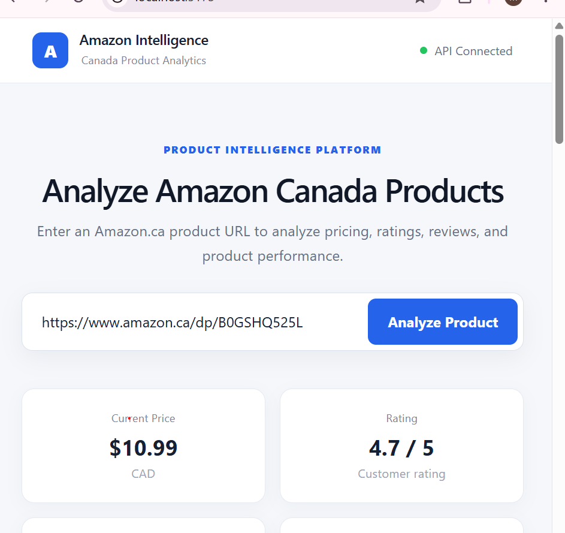
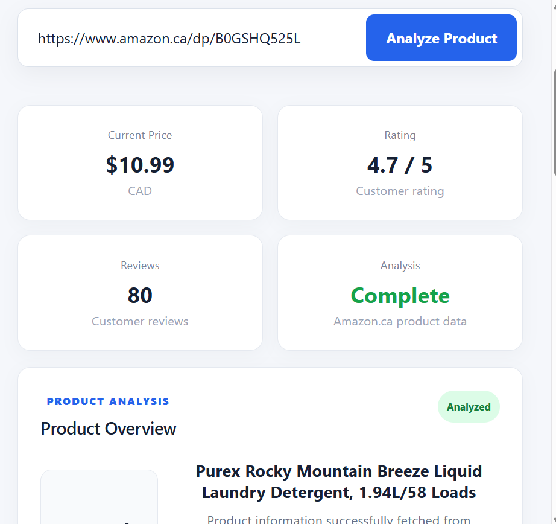
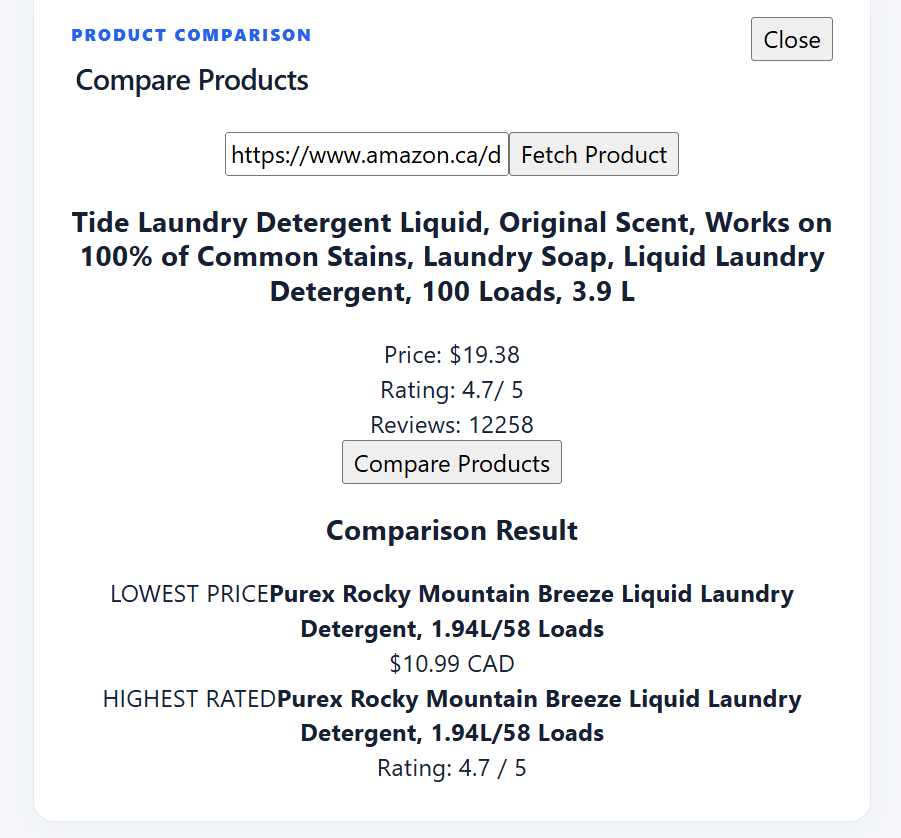

# Amazon Canada Product Intelligence Platform

[](https://www.python.org/)
[](https://fastapi.tiangolo.com/)
[](https://react.dev/)
[](https://vite.dev/)
[](https://github.com/rvitmonisha/amazon-canada-product-intelligence)

An AI-powered product intelligence platform that analyzes Amazon Canada products and provides pricing insights, ratings, review analysis, price history, AI-generated recommendations, and product comparison through a modern web dashboard.

## Features

* **Amazon Product Analysis** — Analyze Amazon.ca product URLs and extract product information.
* **Price Analysis** — View current product pricing and price assessments.
* **Rating and Review Analysis** — Analyze customer ratings and review counts.
* **AI Product Insights** — Generate intelligent product assessments and purchasing recommendations.
* **Price History Tracking** — Track historical product prices.
* **Product Comparison** — Compare two Amazon Canada products side-by-side.
* **Product Intelligence Dashboard** — View product information and insights through a centralized dashboard.
* **REST API Backend** — FastAPI-powered backend for product intelligence services.
* **Responsive Web Interface** — React-based dashboard for interacting with product intelligence features.

## Product Intelligence Dashboard

The platform provides a centralized dashboard for analyzing Amazon Canada products, including pricing, ratings, reviews, AI insights, price history, and product comparison.



## Product Analysis

The product analysis interface provides detailed information about an Amazon Canada product, including current price, rating, customer reviews, and AI-generated insights.



## Product Comparison

The comparison interface allows users to analyze two Amazon Canada products and compare their available product intelligence data.



## Architecture

```text
                         +----------------------+
                         |    User / Browser    |
                         +----------+-----------+
                                    |
                                    v
                         +----------------------+
                         |   React Dashboard    |
                         |       + Vite        |
                         +----------+-----------+
                                    |
                                  REST API
                                    |
                                    v
                         +----------------------+
                         |       FastAPI        |
                         |       Backend       |
                         +----------+-----------+
                                    |
              +---------------------+---------------------+
              |                     |                     |
              v                     v                     v
       +-------------+       +-------------+       +-------------+
       |   Product   |       |    Price    |       |     AI      |
       |    Data     |       |   History   |       |   Insights  |
       |  Extraction |       |   Tracking  |       |  Generation |
       +-------------+       +-------------+       +-------------+
```

## Tech Stack

### Frontend

* React.js
* Vite
* JavaScript
* CSS
* Axios

### Backend

* Python
* FastAPI
* Uvicorn
* BeautifulSoup

### AI and Data Processing

* Python-based product analysis
* AI-powered product insights
* Price analysis
* Rating and review analysis
* Historical price tracking

### Development Tools

* Git
* GitHub
* VS Code

## Project Structure

```text
amazon-canada-product-intelligence/
│
├── backend/
│   └── app/
│       ├── main.py
│       ├── ai_insights.py
│       ├── price_history.py
│       └── ...
│
├── frontend/
│   ├── src/
│   │   ├── App.jsx
│   │   ├── App.css
│   │   └── ...
│   ├── package.json
│   └── ...
│
├── docs/
│   └── images/
│       ├── product-dashboard.png
│       ├── product-analysis.png
│       └── product-comparison.png
│
├── .gitignore
└── README.md
```

## Installation and Setup

### Prerequisites

Make sure the following are installed:

* Python 3.10 or later
* Node.js
* npm
* Git

### 1. Clone the Repository

```bash
git clone https://github.com/rvitmonisha/amazon-canada-product-intelligence.git
cd amazon-canada-product-intelligence
```

### 2. Set Up the Backend

Navigate to the backend directory:

```bash
cd backend
```

Install the required Python dependencies:

```bash
pip install -r requirements.txt
```

Start the FastAPI server:

```bash
uvicorn app.main:app --reload
```

The backend will be available at:

```text
http://127.0.0.1:8000
```

### 3. Set Up the Frontend

Open a new terminal and navigate to the frontend directory:

```bash
cd frontend
```

Install the Node.js dependencies:

```bash
npm install
```

Start the development server:

```bash
npm run dev
```

The frontend will be available at:

```text
http://localhost:5173
```

## How to Use

1. Start the FastAPI backend.
2. Start the React frontend.
3. Open the Product Intelligence Dashboard.
4. Enter a valid Amazon.ca product URL.
5. Click **Analyze Product**.
6. Review the extracted product information.
7. View the current price, rating, reviews, AI insights, and price history.
8. Use **Compare Products** to analyze a second Amazon.ca product.

## Dashboard Capabilities

### Product Analysis

The dashboard provides a centralized product overview containing:

* Product information
* Current price
* Customer rating
* Review count
* Product analysis status

### AI Product Insights

The platform evaluates available product information and generates:

* Price assessment
* Rating assessment
* Review assessment
* Purchase recommendation

### Price History

The platform maintains historical pricing information for analyzed products, allowing users to track price changes over time.

### Product Comparison

Users can enter a second Amazon.ca product URL and compare products based on available product information, pricing, ratings, and reviews.

## API

The backend is built using FastAPI and provides REST endpoints for product intelligence operations.

Interactive API documentation is available through Swagger UI:

```text
http://127.0.0.1:8000/docs
```

The API supports backend functionality for:

* Product analysis
* Product data extraction
* AI insights
* Price history
* Product comparison

## Data Flow

```text
Amazon.ca Product URL
          |
          v
   Product Extraction
          |
          v
   Product Information
          |
     +----+----+
     |         |
     v         v
Price Data   Reviews/Ratings
     |         |
     +----+----+
          |
          v
     AI Analysis
          |
          v
 Product Intelligence
          |
          v
    React Dashboard
```

## Environment Variables

If environment variables are required, create a `.env` file inside the backend directory.

Example:

```env
# Add required configuration variables here
```

Do not commit API keys, passwords, access tokens, or other sensitive credentials to the repository.

## Project Objective

The objective of this project is to transform raw Amazon Canada product information into actionable product intelligence.

Instead of requiring users to manually evaluate multiple product attributes, the platform brings pricing, ratings, reviews, historical price information, and AI-generated insights together in a single dashboard.

## Key Benefits

* Centralized product analysis
* Faster product evaluation
* Automated pricing assessment
* Historical price tracking
* AI-assisted purchasing insights
* Side-by-side product comparison
* REST API-based architecture
* Modern React dashboard

## Future Enhancements

* Advanced price trend visualization
* Price-drop alerts
* Automated product monitoring
* Multi-product comparison
* Product search and discovery
* Historical analytics
* User authentication
* Product watchlists
* Cloud deployment
* Automated scheduled data collection

## Repository

[View the project on GitHub](https://github.com/rvitmonisha/amazon-canada-product-intelligence)

## Author

**M N Monisha**

Computer Science Engineering
RV Institute of Technology and Management

## License

This project is developed for educational and portfolio purposes.
